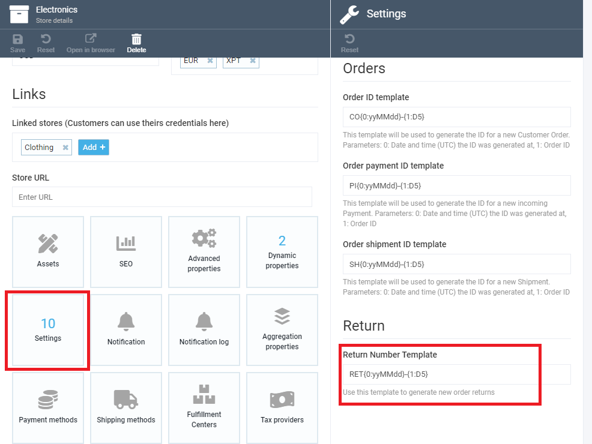
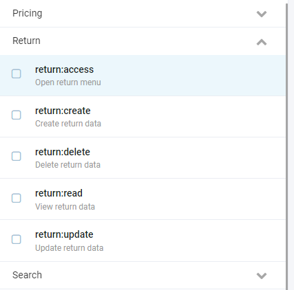


# Return Module Overview
The Return module by Virto Commerce gives you as an ecommerce website or online store admin an opportunity to view and manage all return operations performed by your customers in a single pane of glass. Once a customer returns an item to your store, this information will appear on the Return screen, where you can view and sort the return list at your convenience.

> ***Please note:*** *The Return module is still under development, which means some features are not accessible at the moment and will be available later. Please also see the Important note in the Working with Return Module section.*

# Locating Return Module
To locate the Return module on the Virto Commerce home screen, find it on the left hand panel and click it:

 

If you cannot see it on the panel, click *More* and find it in the list in there:


You can also star the Return module to favorite it; this was, you will always be able to access it from the left hand panel of the home screen.

# Working with Return Module

## Viewing Return List
As mentioned in the overview, the Return module supplies you with a list of all return operations your customers requested. Here is how its home screen may look like:


As you can see, there are default columns, such as Return Number, Order Number, Customer, etc. You can also add more columns, as well as remove any of which you do not need, by ticking or unticking them after clicking the three line button:

 

You can also sort the return operations (both ascending and descending, if applicable) by simply clicking the appropriate column title. The screen capture below shows the items sorted by return number, ascending:


Finally, you can use the search box to type a keyword or key phrase and thus filter only the relevant items. For instance, you can type *New* to view only the return operations that have the *New* status:

 

***Important:*** *You can use both sorting and searching/filtering for all columns, except these three: Order Number, Customer, and Item Count. This is because these columns are borrowed from the Order module and thus are not native to the Return module.*

## Creating Return from List
There are two ways to create a return. The first one is creating it from a return list with the _Add new return_ located on the toolbar:


This button will take you to a screen with orders. Click the order you need to open another screen with this order's line items. Here, you can select line items to return, enter the return reason and quantity, and optionally change the price. Once you select at least one line item with non-zero quantity, the _Make Return_ button will become active. You can also specify the return reason, which is an optional field.

> ***Note:*** *The Quantity field gets automatically validated, which means you cannot return more items than the order contains and that have not been returned with other returns related to this order.*


## Creating Return from Order
The other way to create a return is using the _Create Return_ button in the order screen's toolbar. This will open another screen where you can select line items to return. This is actually the same screen as in the section above, and works identically.


## Editing Returns
You can edit any return by clicking it in the list, while newly created returns get opened for editing automatically. On the main return screen, you can edit both status and reason, with the status list being editable. To open the list of line items, click the widget with item count and its total price on the bottom part of the screen. It works similar to the creating process, apart from there being no checkboxes and no option to enter zero quantity.

> ***Note:*** *You can neither add nor remove line items for an existing return.*


## Related Returns
Any order screen has a widget with the return count related to this particular order. You can click on it to open a screen with a list of related returns:


# Process Chart
The chart below shows how the return lifetime basically works:


> ***Notes:***
>
> *1. Once created, the return cannot be deleted, while you can switch statuses in any way with no restrictions.*
>
> *2. You can change the number of line items within available value.*
>
> *3. You cannot delete line items.*

# API Description

## Search
The search API uses standard search criteria with the following fields:

```json
POST /api/return/search
 
{
  "orderId": "<some_guid>",
  "objectIds": [
    "<some_guid>"
  ],
  "keyword": "<some_keyword>",
  "sort": "Ascending",
  "skip": 0,
  "take": 0
}
```
Here is an example of search response:

```json
{
  "totalCount": 21,
  "results": [
    {
      "number": "RET220314-00001",
      "orderId": "e3ede9031a61421b924bda2fbadf6aef",
      "status": "Approved",
      "resolution": "Some resolution",
      "order": {
		  //customer order fields
	  },
      "lineItems": [
        {
          "returnId": "2fffc88f-014a-48a0-b80d-29a178a43b29",
          "orderLineItemId": "4c893e7fe56348b5a05c8b4671c5f140",
          "quantity": 9,
          "availableQuantity": 0,
          "price": 589.99,
          "reason": "Not wanted",
          "createdDate": "2022-03-14T07:17:08.074618Z",
          "modifiedDate": "2022-03-15T11:47:47.6054095Z",
          "createdBy": "admin",
          "modifiedBy": "admin",
          "id": "1caa064b-d199-4671-beba-126ece340d86"
        },
        {
          "returnId": "2fffc88f-014a-48a0-b80d-29a178a43b29",
          "orderLineItemId": "c32a0b78aac84cb8becf6657fe9895fa",
          "quantity": 7,
          "availableQuantity": 0,
          "price": 399,
          "reason": "Not needed",
          "createdDate": "2022-03-14T07:17:08.0818378Z",
          "modifiedDate": "2022-03-15T11:47:16.6209129Z",
          "createdBy": "admin",
          "modifiedBy": "admin",
          "id": "3504cd3f-d7b9-4b7c-8ab0-6c7aa2d47025"
        }
      ],
      "createdDate": "2022-03-14T07:17:08.0586692Z",
      "modifiedDate": "2022-03-29T13:55:46.5941812Z",
      "createdBy": "admin",
      "modifiedBy": "admin",
      "id": "2fffc88f-014a-48a0-b80d-29a178a43b29"
    }
  ]
}
```
## Other CRUD Operations
GET, PUT and DELETE operations work in the same way.

## Avaliable Quantities
The API has the following URL:

```
/api/return/available-quantities/{orderId}
```

It receives _Order ID_ as a parameter and returns a quantity available for return for each order's line item considering all existing returns for the order in question.
Here is a response example:

```json
{
  "4c893e7fe56348b5a05c8b4671c5f140": 3,
  "c32a0b78aac84cb8becf6657fe9895fa": 21
}
```

# Settings
You can configure the template for generating return numbers in the store settings, individually for every store:



# Permissions

The Return module provides a standard set of permissions: access, create, read, delete, and update.


