
# Return Module Overview
The Return module by Virto Commerce gives you as an ecommerce website or online store admin an opportunity to view and manage all return operations performed by your customers in a single pane of glass. Once a customer returns an item to your store, this information will appear on the Return screen, where you can view and sort the return list at your convenience.

> ***Please note:*** *The Return module is still under development, which means some features are not accessible at the moment and will be available later. Please also see the Important note in the Working with Return Module section.*

# Locating Return Module
To locate the Return module on the Virto Commerce home screen, find it on the left hand panel and click it:

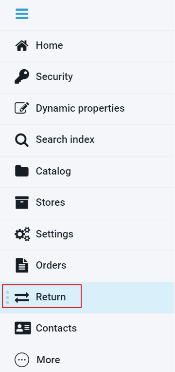 

If you cannot see it on the panel, click *More* and find it in the list in there:

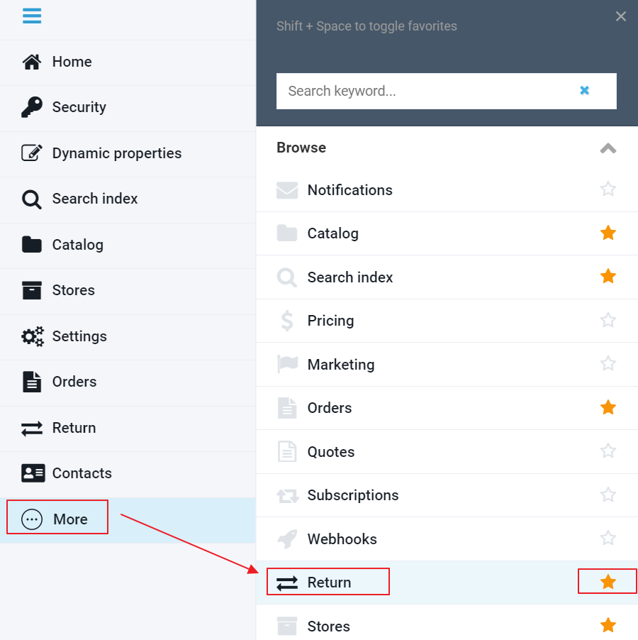

You can also star the Return module to favorite it; this was, you will always be able to access it from the left hand panel of the home screen.

# Working with Return Module

## Viewing Return List
As mentioned in the overview, the Return module supplies you with a list of all return operations your customers requested. Here is how its home screen may look like:

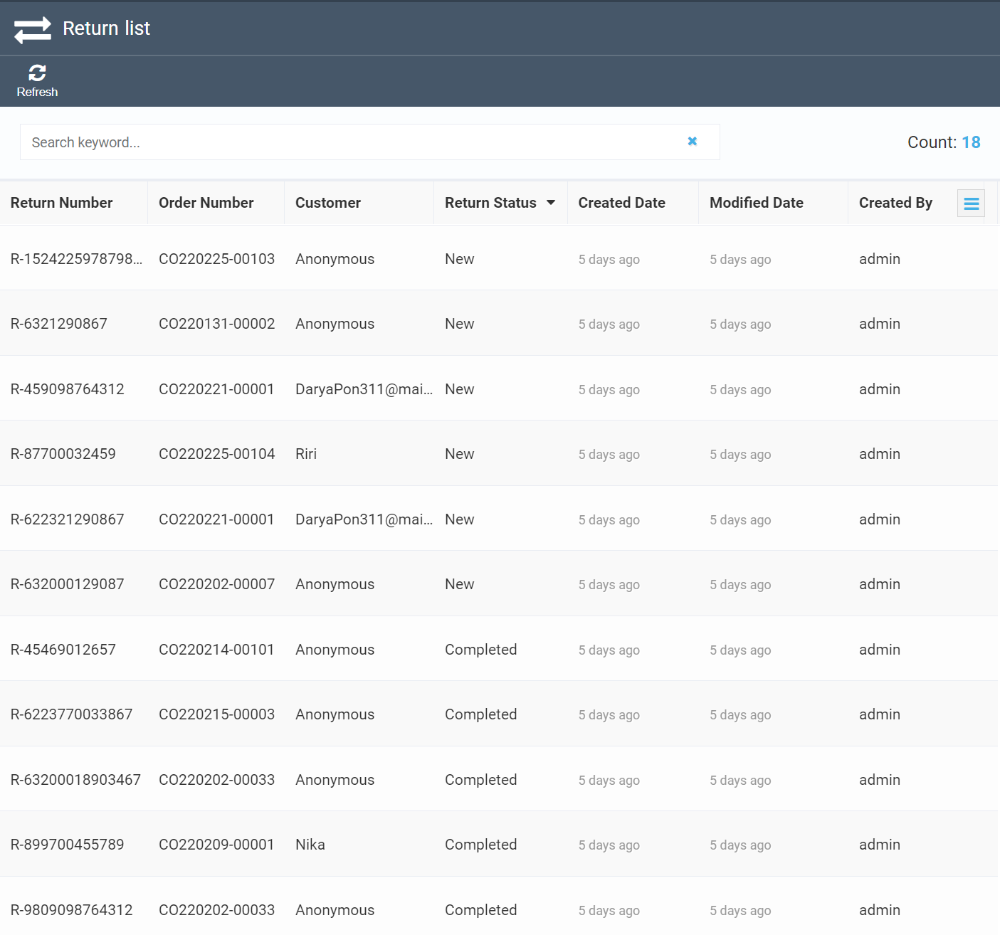

As you can see, there are default columns, such as Return Number, Order Number, Customer, etc. You can also add more columns, as well as remove any of which you do not need, by ticking or unticking them after clicking the three line button:

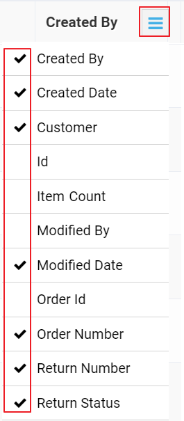 

You can also sort the return operations (both ascending and descending, if applicable) by simply clicking the appropriate column title. The screen capture below shows the items sorted by return number, ascending:

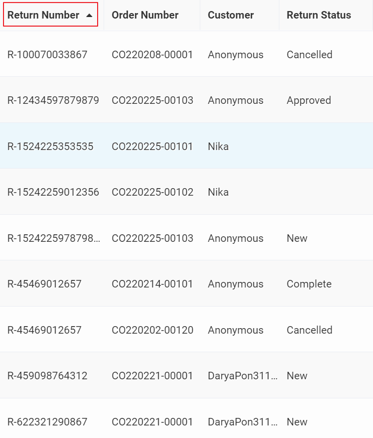

Finally, you can use the search box to type a keyword or key phrase and thus filter only the relevant items. The search covers the return number, the order number, the customer reference and the SKU and name of any returned line item:

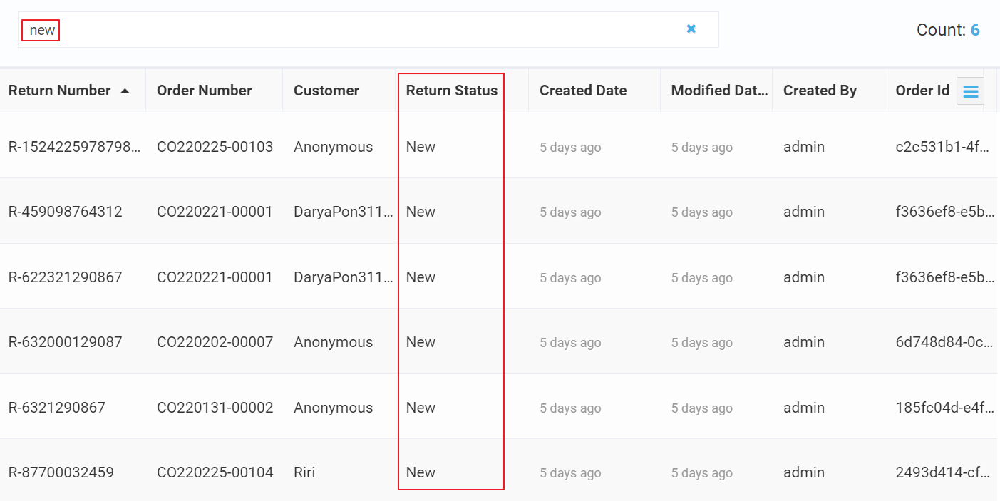 

***Important:*** *The admin grid does not offer sorting on Order Number, Customer or Item Count. Order Number and Customer are now native columns on the return and both are searchable; Item Count is computed and has nothing to sort on.*

## Creating Return from List
There are two ways to create a return. The first one is creating it from a return list with the _Add new return_ located on the toolbar:

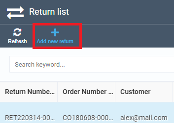

This button will take you to a screen with orders. Click the order you need to open another screen with this order's line items. Here, you can select line items to return, enter the return reason and quantity, and optionally change the price. Once you select at least one line item with non-zero quantity, the _Make Return_ button will become active. You can also specify the return reason. It is optional while the return is a draft and required to
submit it.

> ***Note:*** *The Quantity field gets automatically validated, which means you cannot return more items than the order contains and that have not been returned with other returns related to this order.*

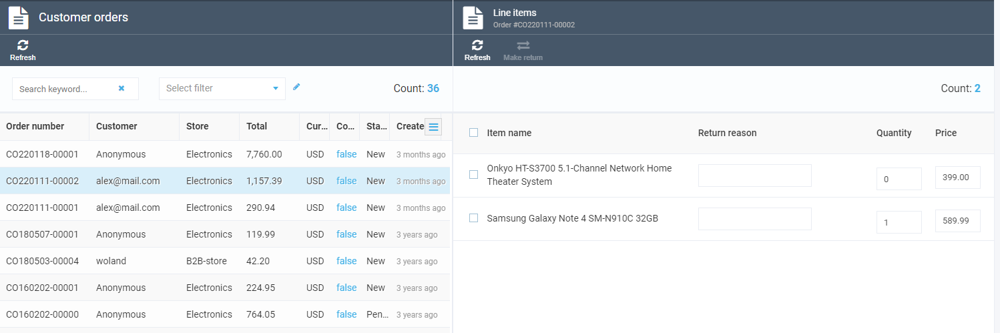

## Creating Return from Order
The other way to create a return is using the _Create Return_ button in the order screen's toolbar. This will open another screen where you can select line items to return. This is actually the same screen as in the section above, and works identically.

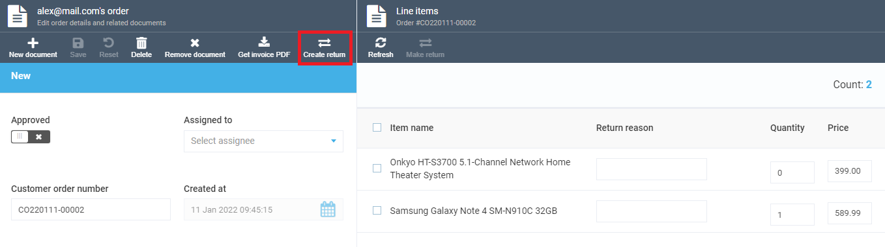

## Editing Returns
You can edit any return by clicking it in the list, while newly created returns get opened for editing automatically. On the main return screen, you can edit both status and reason, with the status list being editable. To open the list of line items, click the widget with item count and its total price on the bottom part of the screen. It works similar to the creating process, apart from there being no checkboxes and no option to enter zero quantity.

> ***Note:*** *You can neither add nor remove line items for an existing return.*

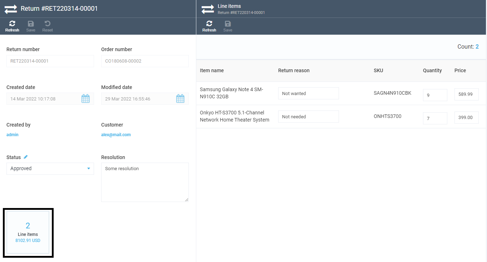

## Related Returns
Any order screen has a widget with the return count related to this particular order. You can click on it to open a screen with a list of related returns:

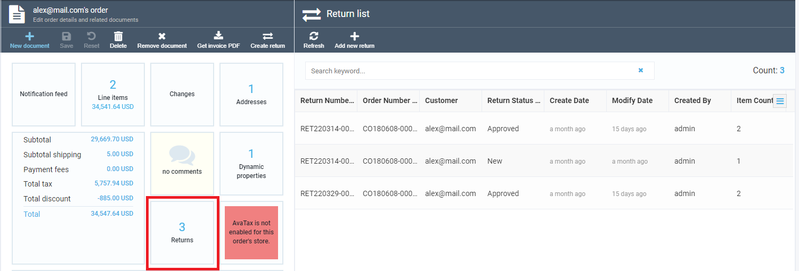

# Process Chart
The chart below shows how the return lifetime basically works:

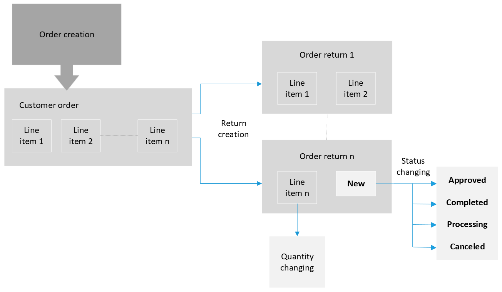

> ***Notes:***
>
> *1. Once created, the return cannot be deleted, while you can switch statuses in any way with no restrictions.*
>
> *2. You can change the number of line items within available value.*
>
> *3. You cannot delete line items.*

# API Description

## Search
The search API uses standard search criteria with the following fields:

```json
POST /api/return/search
 
{
  "orderId": "<some_guid>",
  "objectIds": [
    "<some_guid>"
  ],
  "customerId": "<some_guid>",
  "storeId": "<some_store>",
  "statuses": [
    "Requested"
  ],
  "startDate": "2026-01-01T00:00:00Z",
  "endDate": "2026-12-31T23:59:59Z",
  "keyword": "<some_keyword>",
  "sort": "createdDate:desc",
  "skip": 0,
  "take": 0
}
```
`startDate` and `endDate` both match the `createdDate` inclusively, down to the instant rather than the day. When `sort` is omitted, results come back newest first.

Here is an example of search response:

```json
{
  "totalCount": 21,
  "results": [
    {
      "number": "RET220314-00001",
      "orderId": "e3ede9031a61421b924bda2fbadf6aef",
      "status": "Approved",
      "resolution": "Some resolution",
      "order": {
		  //customer order fields
	  },
      "lineItems": [
        {
          "returnId": "2fffc88f-014a-48a0-b80d-29a178a43b29",
          "orderLineItemId": "4c893e7fe56348b5a05c8b4671c5f140",
          "quantity": 9,
          "price": 589.99,
          "reasonCode": "FaultyOnArrival",
          "reasonComment": "Arrived cracked",
          "createdDate": "2022-03-14T07:17:08.074618Z",
          "modifiedDate": "2022-03-15T11:47:47.6054095Z",
          "createdBy": "admin",
          "modifiedBy": "admin",
          "id": "1caa064b-d199-4671-beba-126ece340d86"
        },
        {
          "returnId": "2fffc88f-014a-48a0-b80d-29a178a43b29",
          "orderLineItemId": "c32a0b78aac84cb8becf6657fe9895fa",
          "quantity": 7,
          "price": 399,
          "reasonCode": "NoLongerNeeded",
          "createdDate": "2022-03-14T07:17:08.0818378Z",
          "modifiedDate": "2022-03-15T11:47:16.6209129Z",
          "createdBy": "admin",
          "modifiedBy": "admin",
          "id": "3504cd3f-d7b9-4b7c-8ab0-6c7aa2d47025"
        }
      ],
      "createdDate": "2022-03-14T07:17:08.0586692Z",
      "modifiedDate": "2022-03-29T13:55:46.5941812Z",
      "createdBy": "admin",
      "modifiedBy": "admin",
      "id": "2fffc88f-014a-48a0-b80d-29a178a43b29"
    }
  ]
}
```
## Other CRUD Operations
GET, PUT and DELETE operations work in the same way.

## Avaliable Quantities
The API has the following URL:

```
/api/return/available-quantities/{orderId}
```

It receives _Order ID_ as a parameter and returns a quantity available for return for each order's line item considering all existing returns for the order in question.

***Note:*** *this endpoint counts every return regardless of its status, so a cancelled or rejected one still consumes quantity. The storefront does not use it; `returnableItems` in the xAPI applies the status rules described under Quantities.*
Here is a response example:

```json
{
  "4c893e7fe56348b5a05c8b4671c5f140": 3,
  "c32a0b78aac84cb8becf6657fe9895fa": 21
}
```

# Settings
You can configure the template for generating return numbers in the store settings, individually for every store:

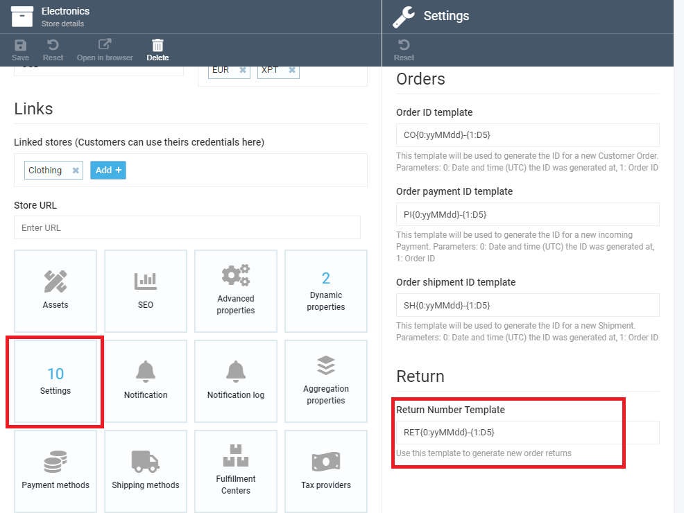

## Line item attachments

Buyers attach photos and documents per return line. Uploads go through the File Experience API, which
resolves its scopes from platform configuration only, so the module cannot register one for you. Until
this entry exists in the platform's `appsettings.json`, `POST /api/files/return-attachments` answers
`InvalidScope`:

```json
{
  "FileUpload": {
    "Scopes": [
      {
        "Scope": "return-attachments",
        "MaxFileSize": 5242880,
        "AllowedExtensions": [ ".jpg", ".jpeg", ".png", ".pdf" ]
      }
    ]
  }
}
```

The size and the extension list are yours to choose; the module deliberately imposes neither.

`Return.AttachmentsRequired` is off by default for the same reason — turned on before the scope exists,
it would refuse every submit for a file the buyer has no way to upload.

A buyer may only attach files they uploaded themselves and that no other return has claimed. Dropping
a line releases its files, and a released file that no return refers to any more is deleted.

## When the rules are applied

A draft is saved on every edit, so a half-filled line has to be allowed to persist: while drafting,
the module only checks lengths and that a reason, if one is given, is in `Return.Reasons`.

Submit runs the same checks and additionally requires a reason on every line, so
`Return.ReasonsRequiringComment` cannot be sidestepped by clearing the reason. Submit validates the
draft as it stands, whoever wrote it — a draft written through `PUT /api/return` is held to the same
rules as one built in the storefront.

## Notifications

The buyer is told when their return is registered, approved, partly approved, declined or cancelled.
Each of these has its own email notification — `ReturnRegisteredEmailNotification`,
`ReturnApprovedEmailNotification`, `ReturnPartiallyApprovedEmailNotification`,
`ReturnRejectedEmailNotification` and `ReturnCancelledEmailNotification` — whose templates can be edited
and translated in the admin like any other notification. Nothing is sent for a draft, or for a draft
that is abandoned before it is submitted.

Two store settings control this:

* `Return.SendNotifications` — email the buyer.
* `Return.SendPushNotifications` — also create an in-app push message. The text is the subject of the
  matching email template. This needs the optional Push Messages module; without it the setting has no
  effect.

**Both are on by default.** A store that already runs the module starts telling its buyers as soon as
this version is installed, without anyone switching anything on. The settings do not exist before the
upgrade, so they cannot be switched off in the store beforehand. To start with them off, override
their defaults in the platform configuration before upgrading — for every store:

```json
{
  "VirtoCommerce": {
    "Settings": {
      "Override": {
        "DefaultValue": {
          "Global": {
            "Return.SendNotifications": false,
            "Return.SendPushNotifications": false
          }
        }
      }
    }
  }
}
```

or for one store under `DefaultValue:Tenants:Store:{storeId}`. The alternative is to switch them off in
the store right after upgrading, before any return changes status.

Sending happens in a Hangfire background job, so a mail server that is slow or down never fails the
save. Emails go through the Notifications module and need an email sender (SMTP or SendGrid) configured
on the platform. It goes where the order's own emails went: the email on the order's addresses first,
then the buyer's contact, then their login. The email is written in the language the return was raised
in, falling back to the store's default language; a language without a template of its own gets the
default one, which ships with the module.

A notification switched off in the admin sends neither the email nor the push message.

### Organization copies

A third store setting, `Return.NotifyOrganizationEmail`, is off by default. With it on, every email the
buyer gets about a return also goes to the first email address of the organization the return was
raised for. The copy is the buyer's own email, not a separate template, so purchasing sees exactly what
the buyer was told. No copy is sent when that address is the one the buyer's email went to. Push
messages stay with the buyer.

## Approving and declining

A submitted return (`Requested`) waits for an agent's decision, and so does one created in the admin
(`New`). Open the return, then its line items,
enter how much of each line is approved and, for anything not approved, why; an optional reason for
the whole return goes underneath. **Approve / decline** records the decision in one step, through
`POST /api/return/{id}/authorize`:

```json
{
  "rejectReason": "Two units were used",
  "items": [
    { "lineItemId": "…", "approvedQuantity": 3, "rejectReason": "Used" },
    { "lineItemId": "…", "approvedQuantity": 2 }
  ]
}
```

Every line needs a decision, from 0 up to the requested quantity. The status follows from the numbers:
`Approved` when every line is approved in full, `Rejected` when nothing is, `PartiallyApproved`
otherwise. Each line is marked as decided, so the return goes on holding only the approved units —
what was not approved can be requested again straight away, on the storefront and in the admin alike.

The decision is written only this way. An edit through `PUT /api/return` keeps the approved quantities
and decline reasons already stored, and once a line is decided also its requested quantity; lines
cannot be added to or removed from a decided return. The status an edit may set is limited too:

* never `Draft`, `Requested`, `Approved`, `PartiallyApproved` or `Rejected` — only submitting and
  authorizing set those;
* never away from `Draft` or `Requested`, which are the buyer's, or from `Rejected` or `Cancelled`,
  which are closed;
* once a return is decided, only on to `AwaitingDelivery`, `Received`, `Processing` or `Completed` —
  a decision cannot be cancelled or undone by an edit;
* otherwise any status in the `Return.Status` dictionary, so a `New` return can still be cancelled.

The status list in the return's details does not offer the statuses only the flow sets.

# Permissions

The Return module provides a standard set of permissions: access, create, read, delete, and update,
plus `return:authorize` to approve and decline returns. Editing a return does not include deciding on it.

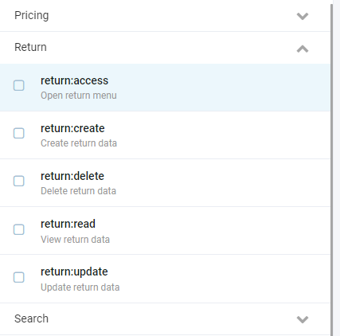

Two storefront permissions are granted to contacts through their role:

* `xapi:my_organization:return:view` lets a contact list and open the returns of the organization they
  have currently selected, with `returns(scope: ORGANIZATION)`. Asking for that scope without the
  permission is refused, not narrowed to the contact's own returns. Colleagues' drafts stay out of it
  until they are submitted. A colleague's return is read-only:
  its actions come back unavailable, every mutation still requires the buyer who raised it, and its
  attachments can be opened but not deleted.
* `xapi:my_organization:return:submit` is registered but not checked yet.

Returns raised before the organization was recorded on them are filled in from their order when the
module is upgraded, provided the Orders tables are in the same database.
