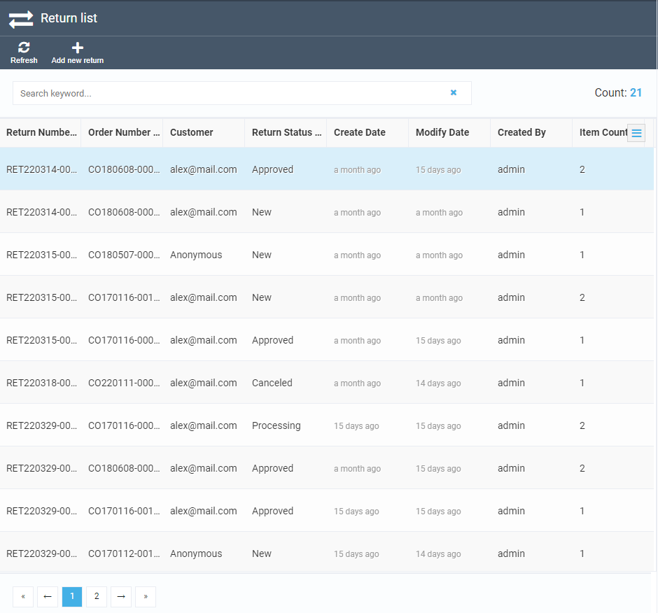

# Return Module Overview
The Return module by Virto Commerce gives you as an ecommerce website or online store admin an opportunity to view and manage all return operations performed by your customers in a single pane of glass. Once a customer returns an item to your store, this information will appear on the Return screen, where you can view and sort the return list at your convenience.
***Please note:*** *The Return module is still under development, which means some features are not accessible at the moment and will be available later. Please also see the Important note in the Working with Return Module section.*

# Locating Return Module
To locate the Return module on the Virto Commerce home screen, find it on the left hand panel and click it:

 

If you cannot see it on the panel, click *More* and find it in the list in there:


You can also star the Return module to favorite it; this was, you will always be able to access it from the left hand panel of the home screen.

# Working with Return Module
## Viewing returns list
As mentioned in the overview, the Return module supplies you with a list of all return operations your customers requested. Here is how its home screen may look like:



As you can see, there are default columns, such as Return Number, Order Number, Customer, etc. You can also add more columns, as well as remove any of which you do not need, by ticking or unticking them after clicking the three line button:

 

You can also sort the return operations (both ascending and descending, if applicable) by simply clicking the appropriate column title. The screen capture below shows the items sorted by return number, ascending:


Finally, you can use the search box to type a keyword or key phrase and thus filter only the relevant items. For instance, you can type *New* to view only the return operations that have the *New* status:

 

***Important:*** *You can use both sorting and searching/filtering for all columns, except these three: Order Number, Customer, and Item Count. This is because these columns are borrowed from the Order module and thus are not native to the Return module.*

## Creating return from the list
There are two ways to create a return. The first is creation from the returns list with the "Add new return" button on top of it.


This button opens a blade with orders. Click on a order opens next blade with order line items. Here you can select line items to be returned, enter returning reason and quantity and optionally change the price. "Make return" button becames active when at least one line item with non-zero quantity is selected. Qunatity field has the validation. You cannot return more items than order contais and wich weren't been returned in oter returns related to this order. Return reason is optional.


## Creating return from the order
The second way to create a return is using "Create return" button on top of the order blade. Click on this button opens a blade for line items selection to be return. It is the same blade as in the section above and works identically.


## Return editing
You can edit return by click on it in the list. Also just created returns are opened for editing automatically. On the main return blade you can edit status and reason. Possible statuses list is editable. The list of line items can be opened by click on the widget with items count and it's total price on the bottom of the blade. It works similar to the creating process, expect absence of the checkboxes and impossibility of entering zero quantity. You cannot add or remove line items for a existing return.


## Related returns
The order blade contains the widget with returns count related to this order. Click on it opens a blade with a list of these returns.


# Process diagram
The return livetime can be described ty the following schema.


Once created, a return cannot be deletet. Statuses can be switched in any direction with no restriction. Quantity of line items can be changed anyhow within available value. Line items themself cannot be deleted

# API description

## Search
Search API uses standard search criteria with the following valuable fields.

```json
POST /api/return/search
 
{
  "orderId": "<some_guid>",
  "objectIds": [
    "<some_guid>"
  ],
  "keyword": "<some_keyword>",
  "sort": "Ascending",
  "skip": 0,
  "take": 0
}
```
There is an example of search response:

```json
{
  "totalCount": 21,
  "results": [
    {
      "number": "RET220314-00001",
      "orderId": "e3ede9031a61421b924bda2fbadf6aef",
      "status": "Approved",
      "resolution": "Some resolution",
      "order": {
		  //customer order fields
	  },
      "lineItems": [
        {
          "returnId": "2fffc88f-014a-48a0-b80d-29a178a43b29",
          "orderLineItemId": "4c893e7fe56348b5a05c8b4671c5f140",
          "quantity": 9,
          "availableQuantity": 0,
          "price": 589.99,
          "reason": "Not wanted",
          "createdDate": "2022-03-14T07:17:08.074618Z",
          "modifiedDate": "2022-03-15T11:47:47.6054095Z",
          "createdBy": "admin",
          "modifiedBy": "admin",
          "id": "1caa064b-d199-4671-beba-126ece340d86"
        },
        {
          "returnId": "2fffc88f-014a-48a0-b80d-29a178a43b29",
          "orderLineItemId": "c32a0b78aac84cb8becf6657fe9895fa",
          "quantity": 7,
          "availableQuantity": 0,
          "price": 399,
          "reason": "Not needed",
          "createdDate": "2022-03-14T07:17:08.0818378Z",
          "modifiedDate": "2022-03-15T11:47:16.6209129Z",
          "createdBy": "admin",
          "modifiedBy": "admin",
          "id": "3504cd3f-d7b9-4b7c-8ab0-6c7aa2d47025"
        }
      ],
      "createdDate": "2022-03-14T07:17:08.0586692Z",
      "modifiedDate": "2022-03-29T13:55:46.5941812Z",
      "createdBy": "admin",
      "modifiedBy": "admin",
      "id": "2fffc88f-014a-48a0-b80d-29a178a43b29"
    }
  ]
}
```
## Other CRUD
GET, PUT and DELETE operations work with the same models.

## Avaliable quantities
The API has URL 
```
/api/return/available-quantities/{orderId}
```

It receives Order ID as parameter and returns avaliable to return quantity for each order's line item considering all existing for this order returns.
Example of response if following:

```json
{
  "4c893e7fe56348b5a05c8b4671c5f140": 3,
  "c32a0b78aac84cb8becf6657fe9895fa": 21
}
```
